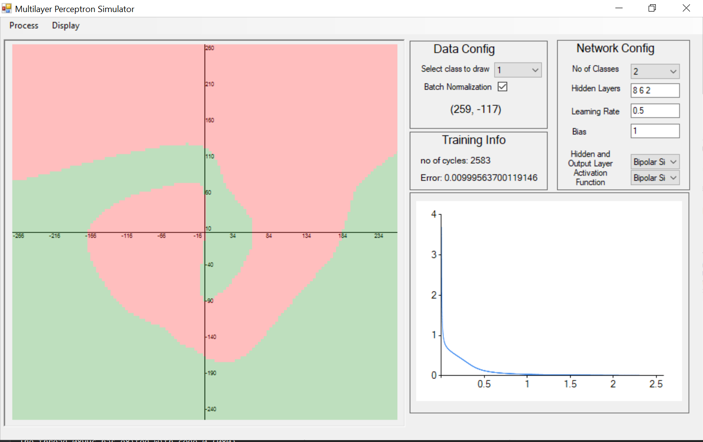

# 2D Multilayer Perceptron Simulator
This is the implementation of a simulator that classifies 2D data into two classes or multi-classes using a multi-layer perceptron(MLP).

 

## Table of contents

* [Multilayer Perceptron](#multilayer-perceptron)
* [Simulator](#2D-simulator)

## Multilayer Perceptron
Multi layer perceptron (MLP) is a class of feedforward artificial neural network (ANN) used to solve problems that require supervised learning (For example, classification problems such as XOR problem). It consists of three types of layers—the input layer, output layer and hidden layer, as shown in the figure below. Each layers consist of neurons which connects a layer to another using connections known as weigths and biases.

 

MLP uses Feed-Forward and Backpropagation for solving supervised learning problems. Feed forward algorithm calculates output data from input data by iteratively using a formula to calculate each neuron in the next layer of the image shown above. Backpropagation is an algorithm used to train (weights and biases) of neural network so that the output data of the network is optimized. When we are training a MLP network, both feed-forward and backpropagation algorithm is used and during the testing phase, only feedforward algorithm is used.
MLP neural network was implemented using  using [matrices](https://github.com/OluwaseunOjeleye/2D-Multilayer-Perceptron-Simulator/blob/master/ANN/matrix.h) and its codes can be found [here](https://github.com/OluwaseunOjeleye/2D-Multilayer-Perceptron-Simulator/blob/master/ANN/ANN.h). This implementation can be run and used independently of the simulator as a C++ user library.

## 2D Simulator
The simulator is a 2D Cartesian coordinate system that accepts samples (Xi, Yi) of a specified class from a user and simulates either MLP Training or Testing operation using the samples. 
 
### Features
Features this implementation supports include:
* Single and multi-layer perceptron neural network configuration
  
* Gradient descent variants
  * Batch gradient descent
* Hidden layer activation functions
  * Sigmoid
  * Bipolar sigmoid
  * Tanh
  * Relu
  * Leaky relu
  * Swish
* Optimization algorithm
  * Momentum
* Preprocessing operations
  * Batch Normalization
* Output layer activation functions
  * Sigmoid
  * Bipolar sigmoid
  * Tanh
  * Relu
  * Leaky relu
  * Swish
* Loss functions
  * Quadratic/L2 loss function
* Loading and saving of samples and network

## Problems
Example of problems solved with the simulator are:
#### 1. XOR Problem
 

#### 2. Circular Data
 

#### 3. Spiral Data
 

## Author
* **Jamiu Oluwaseun Ojeleye**
